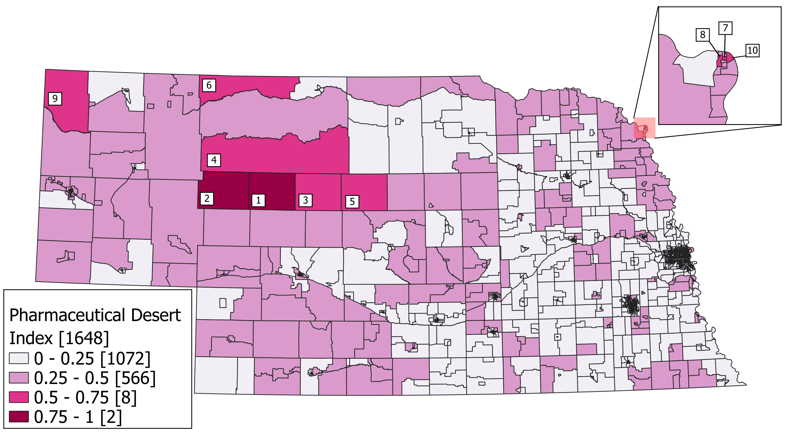
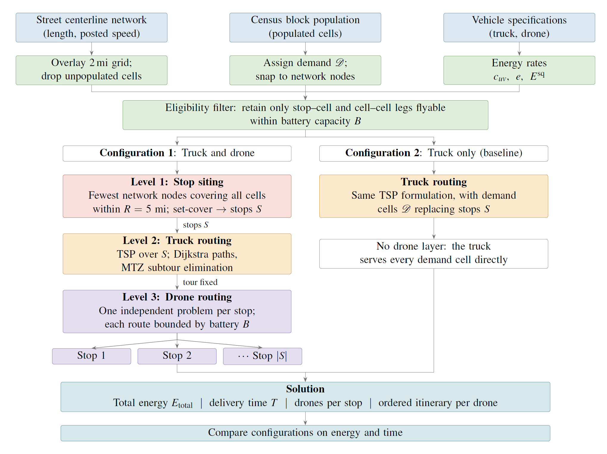

# Autonomous Logistics for Nebraska Pharmaceutical Deserts
 
Code and data for the paper *Where Pharmaceutical Deserts Are and How to Serve Them: A Geospatial Index and Autonomous Routing Study in Rural Nebraska*.
 
The study identifies **pharmaceutical deserts** in Nebraska using a
Pharmaceutical Desert Index (distance to the nearest pharmacy, distance to the
nearest hospital, and social vulnerability), then evaluates delivery options including conventional **truck-only** and
**truck-and-drone** system and quantifies energy, cost and time impacts on the desert and household levels.

<p align="center">
  
</p>

## Repository structure
 
- **`GIS_Work/`** — where the GIS and map work in the paper can be found:
  identifying the pharmaceutical deserts and producing the maps.
- **`Delivery_Optimization/`** — the delivery optimization code, described below.

## Delivery optimization
 
For a set of demand cells and a fixed hub, the pipeline builds a road network,
sites drone-launch stops, samples demand scenarios, routes both delivery systems,
and computes energy, time, and cost. Truck energy is computed with the MOVESTAR
model; drone energy uses a rotor model based on DJI AGRAS T20P specifications. It also compares delivery
against self-drive and hired transport service, on a per-household basis.

<p align="center">
  
</p>
 
### Contents of `Delivery_Optimization/`
 
```
Delivery_Optimization/
├── config.py               # all parameters and paths
├── solver.py               # MIP solver setup (HiGHS)
├── build_network.py        # road graph, node snapping, connectivity
├── network_heal.py         # bridge small gaps in the wider road network
├── siting.py               # stop siting + demand sampling
├── drone_routing.py        # per-stop drone routing (energy-constrained)
├── truck_energy.py         # MOVESTAR truck energy -> shortest-path costs
├── truck_routing.py        # truck tour (traveling salesman, both systems)
├── run_drone_problem.py    # main driver: runs both systems, writes results + routes
├── per_person_analysis.py  # per-household energy/cost vs self-drive and service
├── geopackages/            # input spatial data (below)
└── MOVESTAR/               # MOVESTAR model + coefficient files (below)
```
 
**`geopackages/`**
Includes geopackages needed to run the delivery problem code.

**`MOVESTAR/`**
MOVESTAR is the fuel and emission model used for truck
energy, from the MOVESTAR project:
<https://github.com/ziranw/MOVESTAR-Fuel-and-Emission-Model.git>.
 
### Installing Requirements
 
```
pip install geopandas shapely networkx pyomo highspy pandas numpy scipy
```
 
HiGHS (via `highspy`) is the default solver and requires no license.
 
### How to Run
 
```
cd Delivery_Optimization
python run_drone_problem.py       # both systems, all demand scenarios
python per_person_analysis.py     # per-household comparison
```
 
For battery sensitivity (scales drone battery capacity and coverage radius together):
 
```
BATT_MULT=1.25 python run_drone_problem.py
BATT_MULT=1.5  python run_drone_problem.py
```
The above runs two variants of the same problem where drone battery is increased by 25% and 50%.

### Outputs (`Delivery_Optimization/results/`)
- `summary_drone.csv` — per-scenario energy, time, and cost for both systems.
- `drone_case_<n>.json` — per-scenario detail, including routes and tour orders.
- `drone_routes.gpkg` — drone trip legs (straight) and truck tours (road-following).
- `per_person_summary.csv` — per-household energy and cost comparison.

## Citation
 
If you use the MOVESTAR model, cite the MOVESTAR project:
<https://github.com/ziranw/MOVESTAR-Fuel-and-Emission-Model.git>.
